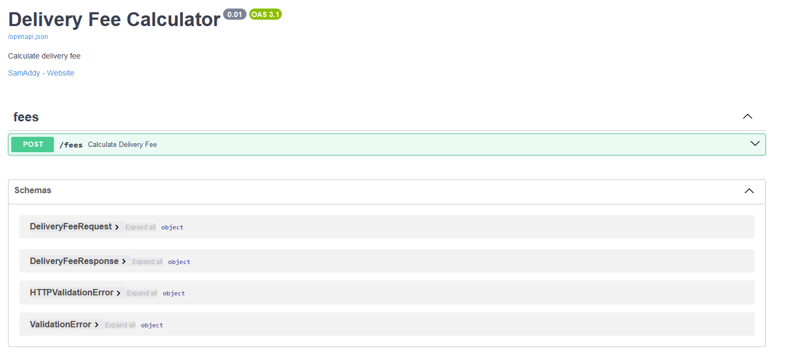
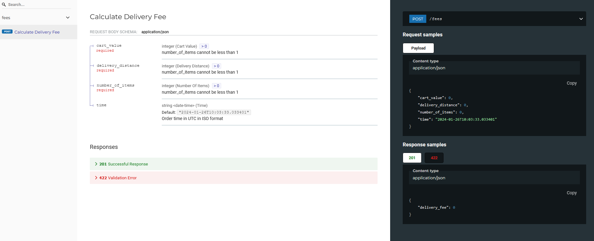

# Delivery Fee Calculator API

The Delivery Fee Calculator is a FastAPI project that helps customers estimate the delivery cost based on their shopping
cart. The delivery fee is determined by factors such as cart value, number of items, order time, and delivery
distance.

## Technology Stack

- [FastAPI](https://fastapi.tiangolo.com/): A modern, fast (high-performance), web framework for building APIs with
  Python 3.7+ based on standard Python type hints.
- [Python](https://www.python.org/): A popular and easy-to-use programming language
- [uvicorn](https://www.uvicorn.org/): An ASGI server to run the FastAPI application.
- [Swagger UI](https://swagger.io/tools/swagger-ui/) and [ReDoc](https://redocly.com/docs/redoc/): FastAPI provides
  interactive API documentation through Swagger UI (http://localhost:8000/docs) and ReDoc (http://localhost:8000/redoc).

## Installation

1. Navigate to the root directory of the project in your terminal:
    ```bash
    cd delivery_fee_calculator/
    ```
2. Create a virtual environment:
    ```bash
    python -m venv venv
    ```
3. Activate the virtual environment:
    - On Windows:
         ```bash
         venv\Scripts\activate
         ```
    - On Unix or macOS:
      ```bash
      source venv/bin/activate
      ```

4. Install dependencies:
    ```
    pip install -r requirements.txt
    ```

## Usage

1. Run the app once virtual environment is activated:
    ```bash
    uvicorn delivery_fee_calculator.main:app --reload
    ```

2. API Documentation:
    - Swagger UI: http://localhost:8000/docs
      
    - ReDoc: http://localhost:8000/redoc
      

3. The endpoint can also be tested using `requests` in CLI.
    ```bash
    >>> import requests
    >>> payload = {
    ...     "cart_value": 790,
    ...     "delivery_distance": 2235,
    ...     "number_of_items": 4,
    ...     "time": "2024-01-15T13:00:00Z"
    ... }
    >>> response = requests.post("http://localhost:8000/fees", json=payload)
    >>> response.text
    '{"delivery_fee":710}'

    ```

#### Request

Example:

```json
{
  "cart_value": 790,
  "delivery_distance": 2235,
  "number_of_items": 4,
  "time": "2024-01-15T13:00:00Z"
}
```

##### Field details

| Field             | Type    | Description                                                                | Example value                            |
|:------------------|:--------|:---------------------------------------------------------------------------|:-----------------------------------------|
| cart_value        | Integer | Value of the shopping cart __in cents__.                                   | __790__ (790 cents = 7.90€)              |
| delivery_distance | Integer | The distance between the store and customer’s location __in meters__.      | __2235__ (2235 meters = 2.235 km)        |
| number_of_items   | Integer | The __number of items__ in the customer's shopping cart.                   | __4__ (customer has 4 items in the cart) |
| time              | String  | Order time in UTC in [ISO format](https://en.wikipedia.org/wiki/ISO_8601). | __2024-01-15T13:00:00Z__                 |

#### Response

Example:

```json
{
  "delivery_fee": 710
}
```

##### Field details

| Field        | Type    | Description                           | Example value               |
|:-------------|:--------|:--------------------------------------|:----------------------------|
| delivery_fee | Integer | Calculated delivery fee __in cents__. | __710__ (710 cents = 7.10€) |

## Project Structure

```structure
Samuel_Addison-engineering-internship-2024
│
│   delivery_fee_calculator/
│   │
│   │
│   ├── delivery_fee_calculator/
│   │   ├── __init__.py
│   │   ├── fee_calculator.py
│   │   ├── main.py
│   │   ├── schemas.py
│   │
│   │
│   ├── tests/
│   │   ├── __init__.py
│   │   ├── test_data.py
│   │   ├── test_fee_calculator.py
│   │   ├── test_main.py
│   
├── example_ui.png
├── README.md
├── redo_screenshot.png
├── requirements.txt
├── swagger_ui_screenshot
├── TASK.md
├── yuhos.png

```